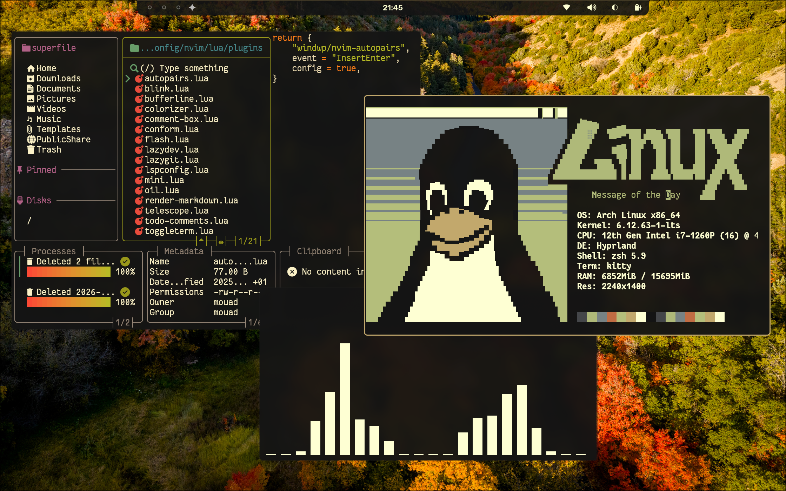
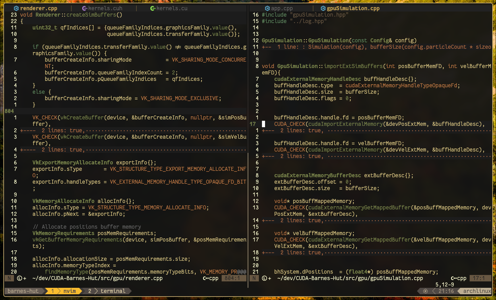

# dotfiles

    <table>
        <tr>
            <td></td>
        </tr>
    </table>

   

    <table>
        <tr>
            <td></td>
        </tr>
        <tr>
            <td>Waybar</td>
        </tr>
    </table>

 

    <table>
        <tr>
            <td></td>
        </tr>
        <tr>
            <td>Nvim + Tmux</td>
        </tr>
    </table>

 

    <table>
        <tr>
            <td></td>
        </tr>
        <tr>
            <td>Hyprlock</td>
        </tr>
    </table>

 
